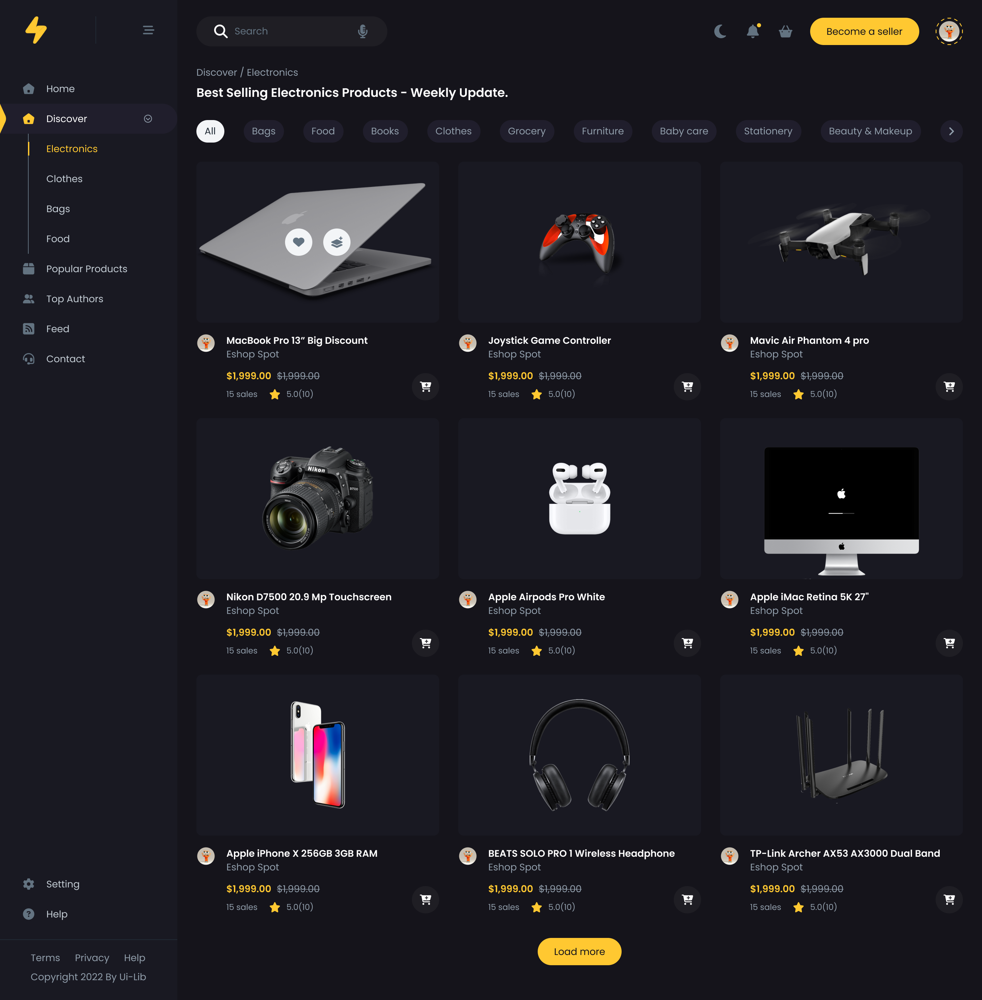

# Ecommerce Product Page Clone

This project is a front-end representation of an ecommerce product page designed to provide a seamless and interactive shopping experience.

## [🔗 Live Preview](https://ecommerce-product-page-clh.pages.dev)

## Deisgn Preview

[Original design link](https://www.figma.com/community/file/1226930260218793008/protech-minimal-ecommerce-template)

## Features

- **Responsive Sidebar Navigation**: Utilizes CSS Flexbox for a flexible layout. The sidebar includes a navigation menu for easy access to different sections of the ecommerce platform, such as Home, Discover, Popular Products, Top Authors, Feed, and Contact.
- **Interactive Main Content Area**: The main section of the page is designed to showcase products, search functionality, notifications, and user profile information, promoting an engaging user experience.
- **Advanced CSS Styling**: Employs modern CSS features such as variables for consistent theming, Flexbox for layout management, and custom properties for easy maintenance and scalability.
- **SVG Icons and Images**: Incorporates SVG icons and images for crisp, scalable graphics that enhance the visual appeal of the page without compromising on load times.
- **Accessibility Features**: Includes semantic HTML5 elements to improve accessibility and SEO.

## CSS Concepts Used

- **CSS Flexbox**: Used extensively for creating flexible and responsive layouts, especially in the sidebar navigation and main navbar sections.
- **CSS Grid**: Although not explicitly mentioned in the provided context, CSS Grid could be utilized in the product listing section for arranging items in a grid layout efficiently.
- **CSS Variables**: Enables easier theming and reusability across the stylesheet by defining common values (such as colors, font sizes, etc.) in one place.
- **CSS Nesting with `&` Selector**: The CSS `&` nesting selector defines the relationship between parent and child rules within native CSS nesting contexts. It allows child rule selectors to be explicitly related to the parent element, making the selector's scope clear and concise. This feature is particularly useful for specifying nested child rules in relation to their parent, ensuring that the child selectors are treated as if they were directly related to the parent, similar in specificity weight to selectors within `:is()`. This native CSS capability streamlines the creation of complex stylesheets by simplifying the declaration of relationships between nested selectors.

## Conclusion

This project demonstrates a comprehensive application of modern web development techniques, focusing on responsive design, user experience, and accessibility. By leveraging CSS Flexbox, variables, and potentially CSS Grid, along with thoughtful HTML structure, the ecommerce product page is both visually appealing and functionally robust.
